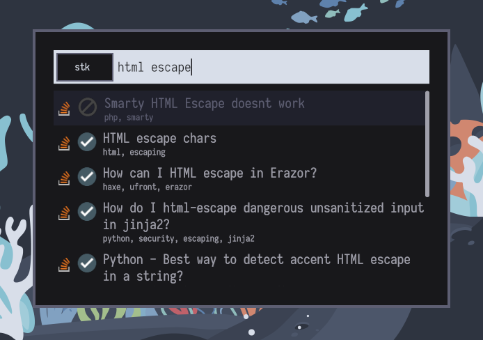

# Pop-launcher Stackoverflow plugin

Search stackoverflow posts via pop-launcher.



## Installation

**Requirements:**
- [Just](https://github.com/casey/just)
- [Rust/Cargo](https://www.rust-lang.org/)
- [pop-launcher](https://github.com/pop-os/launcher)

**Install:**

```shell
just install
```

Once the installation is done it should open a stackoverflow authentication page on your browser. 
Proceed and copy the in-url token to `~/.local/share/pop-launcher/plugins/stackoverflow/config.ron` :

```ron
(
 access_token: "my-access-token"
)
```

## Usage

Just type "stk " followed by a search query to lookup stackoverflow posts. 
